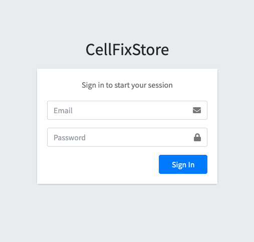
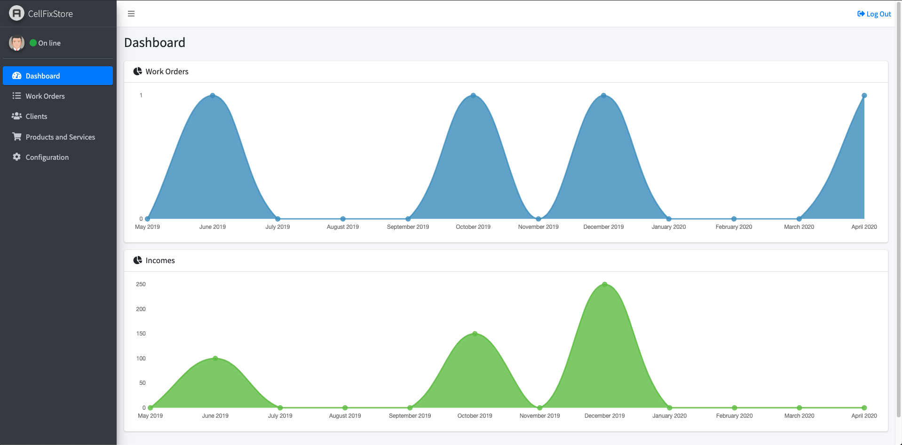
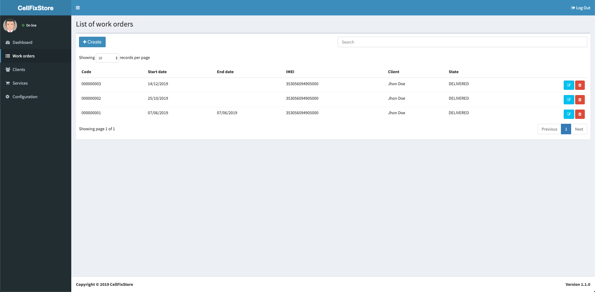

# CellFixStore
A system for mobile workshops that allows you to keep track of work orders...

## Project screens







## Setup project

##### Create directory for your virtual environment
###### On your home directory create a folder to add virtualenv
```
mkdir .virtualenvs && cd .virtualenvs/
```

##### Create virtualenv and run
```
python3 -m venv cellfixstore
```
```
source cellfixstore/bin/activate
```

##### Install project dependencies
###### Go to the directory of the CellFixStore project you just download and execute (stay in the virtual environment)
```
pip install -r requirements.txt
```

##### Create Django migrations
```
./manage.py makemigrations
```

##### Run migrations to database
```
./manage.py migrate
```

##### Superuser
```
./manage.py createsuperuser
```

##### Run server
```
./manage.py runserver
```

###### Access app in http://localhost:8000 with the user you just create.

## Thanks to
###### https://github.com/ColorlibHQ/AdminLTE for the free template.
###### All developers who take their time to publish documents, so we can all learn.

